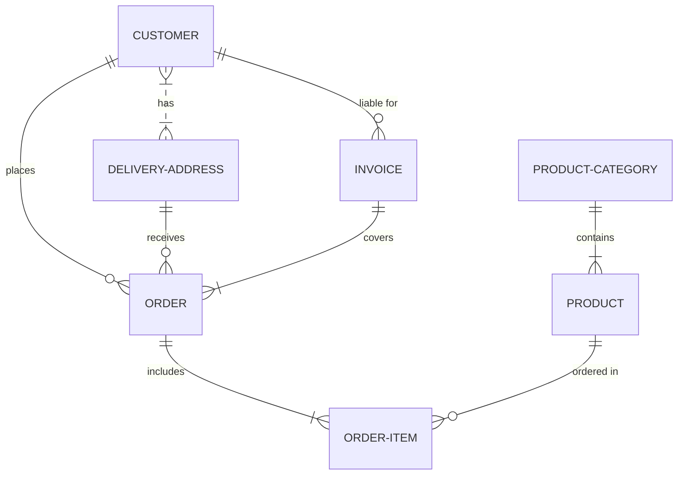

Proof of Concept that adds an ec2 repo with ssm patching support

usage:
Before executing terraform plan/terraform apply

Create file dev/secret.tf and insert login crdentials

```
var secret_key {
  type = string,
  value = "***********"
}

var access_key {
  type = string,
  value =  "**********"
}
```


Testing a mermaid diagram




